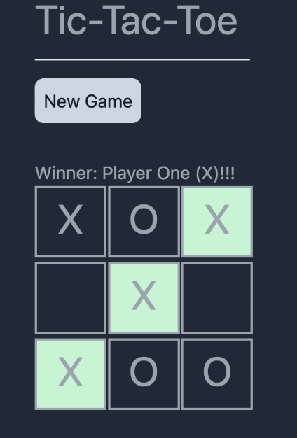

# tic-tac-toe

Simple tic-tac-toe game created in VueJs with single (vs bot) and two player mode

## Local Dev

-   Clone the repo
-   `npm install`
-   `npm run dev`

## Recommended IDE Setup

-   [VS Code](https://code.visualstudio.com/) + [Volar](https://marketplace.visualstudio.com/items?itemName=Vue.volar) (and disable Vetur) + [TypeScript Vue Plugin (Volar)](https://marketplace.visualstudio.com/items?itemName=Vue.vscode-typescript-vue-plugin).
